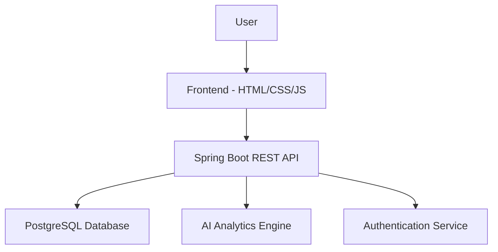

# 💰 Khata Book - Expense Management System

[](https://spring.io/)
[](https://www.postgresql.org/)
[](https://developer.mozilla.org/en-US/docs/Web/JavaScript)
[](LICENSE)

> A Splitwise-inspired expense management application with AI-driven insights for smart financial tracking and group expense splitting.


## ✨ Features

### 📊 **Expense Management**
- **Group Expense Splitting** - Split bills among friends with customizable shares
- **Personal Expense Tracking** - Monitor individual spending with categories
- **Multi-Currency Support** - Handle expenses in different currencies
- **Receipt Upload** - Attach and store expense receipts

### 🤖 **AI-Driven Insights**
- **Spending Pattern Analysis** - Visualize where your money goes
- **Budget Forecasting** - Predict future expenses based on history
- **Smart Categorization** - Automatically categorize expenses using AI
- **Savings Recommendations** - Get personalized tips to save money

### 👥 **Social Features**
- **Friend Groups** - Create groups for trips, households, or events
- **Settlement Tracking** - Track who owes whom with clear balances
- **Activity Feed** - See recent expenses and settlements
- **Notifications** - Get reminded about pending payments

### 📱 **User Experience**
- **Responsive Design** - Works on desktop, tablet, and mobile
- **Dark/Light Mode** - Choose your preferred theme
- **Export Data** - Download expenses as CSV/PDF
- **Offline Support** - Basic functionality without internet

## 🏗️ Architecture



## 🚀 Quick Start

### Prerequisites
- Java 17 or higher
- PostgreSQL 16+
- Node.js 18+ (for frontend tools)
- Maven 3.8+


## 📁 Project Structure

khata-book/
├── backend/
│   ├── src/main/java/com/khatabook/
│   │   ├── controller/          # REST Controllers
│   │   ├── service/             # Business Logic
│   │   ├── repository/          # Data Access Layer
│   │   ├── model/              # Entity Classes
│   │   ├── config/             # Configuration
│   │   └── security/           # Authentication & Authorization
│   ├── src/main/resources/
│   │   ├── application.properties
│   │   └── static/             # Frontend assets (optional)
│   └── pom.xml
├── frontend/
│   ├── index.html              # Main HTML file
│   ├── css/
│   │   ├── style.css          # Main styles
│   │   ├── dashboard.css      # Dashboard styles
│   │   └── responsive.css     # Responsive styles
│   ├── js/
│   │   ├── main.js            # Main JavaScript
│   │   ├── auth.js            # Authentication logic
│   │   ├── expenses.js        # Expense management
│   │   ├── groups.js          # Group operations
│   │   └── analytics.js       # AI insights
│   └── assets/                # Images, icons, etc.
├── database/
│   ├── schema.sql             # Database schema
│   └── sample-data.sql        # Sample data
├── docker-compose.yml
├── Dockerfile
└── README.md


## 📊 AI Analytics Features

### Smart Expense Categorization
- **Automated Tagging**: AI automatically categorizes expenses based on description
- **Pattern Recognition**: Learns from your manual categorizations
- **Merchant Detection**: Identifies merchants and suggests categories

### Predictive Analytics
```java
// Backend Example - Expense Prediction Service
@Service
public class ExpensePredictionService {
    
    public PredictionResult predictNextMonthExpenses(User user) {
        // ML model to predict based on historical data
        // Considers seasonality, trends, and user behavior
        return mlModel.predict(user.getExpenseHistory());
    }
    
    public List<SavingsRecommendation> generateRecommendations(User user) {
        // AI-powered savings suggestions
        return aiEngine.analyzeSpendingPatterns(user);
    }
}
```


## 🧪 Testing

### Backend Tests
```bash
cd backend
mvn test

# Run specific test
mvn test -Dtest=ExpenseServiceTest

# Integration tests
mvn verify
```

### Frontend Tests
```bash
cd frontend
# If using a testing framework
npm test
```

## 🤝 Contributing

1. Fork the repository
2. Create a feature branch (`git checkout -b feature/amazing-feature`)
3. Commit your changes (`git commit -m 'Add amazing feature'`)
4. Push to the branch (`git push origin feature/amazing-feature`)
5. Open a Pull Request

### Development Guidelines
- Follow Java/Spring Boot best practices
- Write meaningful commit messages
- Add tests for new features
- Update documentation accordingly

## 📄 License

This project is licensed under the MIT License - see the [LICENSE](LICENSE) file for details.

## 🙏 Acknowledgments

- Inspired by **Splitwise** for group expense management concepts
- Built with **Spring Boot** for robust backend services
- Uses **PostgreSQL** for reliable data storage
- **Chart.js** for beautiful data visualizations

## 🌟 Why Choose Khata Book?

| Feature | Khata Book | Traditional Apps |
|---------|------------|------------------|
| **AI Insights** | ✅ Smart recommendations | ❌ Basic charts |
| **Group Splitting** | ✅ Flexible splitting | ✅ Limited options |
| **Multi-Currency** | ✅ Automatic conversion | ❌ Manual only |
| **Offline Support** | ✅ Partial functionality | ❌ None |
| **Open Source** | ✅ Free & customizable | ❌ Proprietary |

---

**Star this repo if you find it useful!** ⭐

**Happy expense tracking!** 💰📊

---

*Built with ❤️ for better financial management. Simplify your expenses with Khata Book!*
